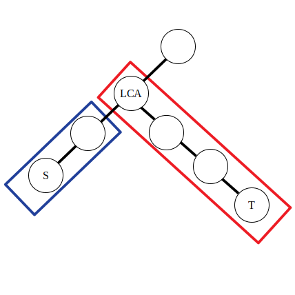
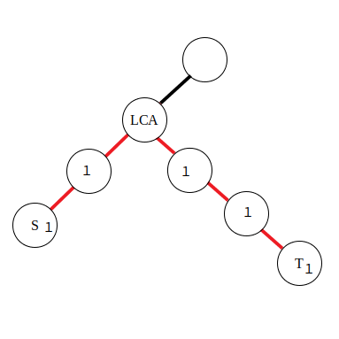

This article will briefly introduce prefix sum, and its opposite strategy, adjacent difference.

## Prefix Sum

Prefix sum is an important kind of preprocessing, which can significantly reduce the time complexity of querying. It can be simply understood as "the sum of the first $n$ elements of an array". [^note1]

C++ standard library has implemented the function of constructing prefix sum array [`std::partial_sum`](https://en.cppreference.com/w/cpp/algorithm/partial_sum), defined in the header `<numeric>`.

### Example

!!! Example
    You are given an array $A$ with $N$ positive integers. You are asked to construct a new array $B$, where the $i$-th element of new array $B[i]$ represents the sum of the $0$-th to $i$-th elements of the original array $A$.
    
    Input:
    
    ```text
    5
    1 2 3 4 5
    ```
    
    Output:
    
    ```text
    1 3 6 10 15
    ```

??? note "Solution"
    There are two approaches for this problem:
    
    - Put the accumulative sum of array $A$ to array $B$ one by one.
    - Iteration: `B[i] = B[i-1] + A[i]`, and specifically `B[0] = A[0]`。

??? note "Example Solution Code"
    ```cpp
    #include <iostream>
    using namespace std;
    
    int N, A[10000], B[10000];
    int main() {
      cin >> N;
      for (int i = 0; i < N; i++) {
        cin >> A[i];
      }
    
      // First element of original array and prefix sum array are equivalent. 
      B[0] = A[0];
    
      for (int i = 1; i < N; i++) {
        // i-th element of prefix sum array = sum of 0th to (i-1)-th elements of original array + i-th element of original array
        B[i] = B[i - 1] + A[i];
      }
    
      for (int i = 0; i < N; i++) {
        cout << B[i] << " ";
      }
    
      return 0;
    }
    ```

### 2-Dimensional and Multi-Dimensional Prefix Sum 

Naive approach for finding multi-dimensional prefix sum are mostly based on the [inclusion-exclusion principle](../math/inclusion-exclusion-principle.md).

???+note "Example: Extending 1-dimensional prefix sum to 2-dimensional prefix sum."
    For example, we have a matrix $a$, which can be treated as a 2-dimension array 
    
    ```text
    1 2 4 3
    5 1 2 4
    6 3 5 9
    ```
    
    We define a matrix $sum$, where $sum_{x,y} = \sum\limits_{i=1}^x \sum\limits_{j=1}^y a_{i,j}$，  
    Then the matrix looks like this:
    
    ```text
    1  3  7  10
    6  9  15 22
    12 18 29 45
    ```
    
    The first problem is the process of finding $sum$ by iteration: $sum_{i,j} = sum_{i - 1,j} + sum_{i,j - 1} - sum_{i - 1,j - 1} + a_{i,j}$.
    
    Because of the addition of $sum_{i - 1,j}$ and $sum_{i,j - 1}$ is duplicated with $sum_{i - 1,j - 1}$, here subtracted it.
    
    The second problem is how to apply, e.g., calculate the sum of sub-matrixes $(x1,y1) - (x2,y2)$.
    
    Then we can easily conclude that $sum_{x2,y2} - sum_{x1 - 1,y2} - sum_{x2,y1 - 1} + sum_{x1 - 1,y1 - 1}$ based on similar idea.

#### Example

???+note "[Luogu P1387](https://www.luogu.com.cn/problem/P1387)"
    Given a $n*m$ matrix with only $0$ and $1$. Your task is to find the largest square without $0$ in the matrix and print the length of its edge.

??? note "Example Solution Code"
    ```cpp
    #include <algorithm>
    #include <iostream>
    using namespace std;
    int a[103][103];
    int b[103][103];  // Prefix sum array, which is equivalent to `sum[]` mentioned before.
    int main() {
      int n, m;
      cin >> n >> m;
    
      for (int i = 1; i <= n; i++) {
        for (int j = 1; j <= m; j++) {
          cin >> a[i][j];
          b[i][j] =
              b[i][j - 1] + b[i - 1][j] - b[i - 1][j - 1] + a[i][j];  // Calculate the prefix sum.
        }
      }
    
      int ans = 1;
    
      int l = 2;
      while (l <= min(n, m)) {
        for (int i = l; i <= n; i++) {
          for (int j = l; j <= m; j++) {
            if (b[i][j] - b[i - l][j] - b[i][j - l] + b[i - l][j - l] == l * l) {
              ans = max(ans, l);
            }
          }
        }
        l++;
      }
    
      cout << ans << endl;
      return 0;
    }
    ```

### High-Dimensional Sum over Subsets Dynamic Programming

The method of calculating multi-dimensional prefix sum based on inclusion-exclusion principle has an advantage of simple form and no need to memorize specifically. But as the dimension increases, the algorithm would have high complexity. This chapter will introduce a method of calculating high-dimensional prefix sum based on [dynamic programming](../dp/basic.md). <!--- This method is what is commonly referred to in the context as **high-dimensional prefix sum**.

Let $U$ to be a high-dimensional space with $D$ dimensions. We need to find the high-dimensional prefix sum $\text{sum}[\cdot]$ of $f[\cdot]$. Let $\text{sum}[i][\text{state}]$ represent all contribution to high-dimensional prefix sum of $\text{state}$ from all same node of $D-i$-th dimension after $\text{state}$. From the definition we know that $\text{sum}[0][\text{state}] = f[\text{state}]$ and $\text{sum}[\text{state}] = \text{sum}[D][\text{state}]$. <!---看不懂qaq-->

The iteration is $\text{sum}[i][\text{state}] = \text{sum}[i - 1][\text{state}] + \text{sum}[i][\text{state}']$, where $\text{state}'$ is all node that $1$ smaller than $\text{state}$ in $i$-th dimension, where $|U|$ is the size of high-dimensional space $U$.

Here is an example of implementation in pseudo code:
```
    for state
      sum[state] = f[state];
    for(i = 0;i <= D;i += 1)
      for state (in lexicographic order)
        sum[state] += sum[state'];
```

### Prefix Sum on Tree

Let $sum_i$ represent the sum of weight from node $i$ to root node.
Then:

- If weight is on nodes: Sum in path $x,y$ is $sum_x + sum_y - sum_{lca} - sum_{fa_{lca}}$.
- If weight is on edges: Sum in path $x,y$ is $sum_x + sum_y - 2sum_{lca}$.

About how to calculate $lca$ please refer to [Lowest Common Ancestor](../graph/lca.md).

## Adjacent Difference

Adjacent difference is a strategy opposite to prefix sum, which can be treated as an inverse operation to sum.

The definition is let $b_i=\begin{cases}a_i-a_{i-1}\,&i \in[2,n] \\ a_1\,&i=1\end{cases}$.

Simple properties:

- $a_i$ is prefix sum of $b_i$, i.e., $a_n=\sum\limits_{i=1}^nb_i$.
- Calculate prefix sum of $a_i$: $sum=\sum\limits_{i=1}^na_i=\sum\limits_{i=1}^n\sum\limits_{j=1}^{i}b_j=\sum\limits_{i}^n(n-i+1)b_i$

它可以维护多次对序列的一个区间加上一个数，并在最后询问某一位的数或是多次询问某一位的数。注意修改操作一定要在查询操作之前。<!---?-->

???+note "Example"
    For example, adding $k$ to every element in $[l,r]$ is
    
    $$
    b_l \leftarrow b_l + k,b_{r + 1} \leftarrow b_{r + 1} - k
    $$
    
    where $b_l+k=a_l+k-a_{l-1}$，$b_{r+1}-k=a_{r+1}-(a_r+k)$.
    
    And perform prefix sum once in the end.

C++ standard library has the implementation of constructing an adjacent difference array [`std::adjacent_difference`](https://en.cppreference.com/w/cpp/algorithm/adjacent_difference)，defined in header file `<numeric>`.

### Adjacent Difference on Tree

The phrase, adjacent difference on tree, can be understood as performing adjacent difference on some path of tree, where "path" can be comprehended similar to the interval in one-dimensional array. Adjacent difference on tree can be used<!---handy?--> when, for example, operating intensively on some paths, and querying the value of some edge or node after operating.

In competitive programming, related problems are sometimes solved in accompany with [tree](../graph/tree-basic.md) and [LCA](../graph/lca.md). In further, adjacent difference on tree can be divided into **difference on node** and **difference on edge** with slight difference in implementation.

#### Difference on Node

Example: Access some paths in a domain tree $\delta(s_1,t_1), \delta(s_2,t_2), \delta(s_3,t_3)\dots$. Find out how many times the nodes in a path $\delta(s,t)$ have been accessed.

For an access to $\delta(s,t)$ we need to find the LCA of $s$ and $t$, and accessing all nodes in the path by adding 1 on their weight. Because there are enormous nodes needed to be accessed, we cannot afford the time cost if we adopt a DFS algorithm to access every node. Therefore here performs adjacent difference.

$$
\begin{aligned}
&d_s\leftarrow d_s+1\\
&d_{lca}\leftarrow d_{lca}-1\\
&d_t\leftarrow d_t+1\\
&d_{f(lca)}\leftarrow d_{f(lca)}-1\\
\end{aligned}
$$

Where $f(lca)$ represents the parent node of $lca#, and $d_i$ is the adjacent difference array of node weight array $a_i$,



In the illustration, we can acknowledge that the former two formulas operate the path tagged by blue rectangle, and latter two operate the path tagged by red rectangle. Why not name the immediate child node to the left side of $lca$ ad $left$. In this case we have $d_{lca}-1=a_{lca}-(a_{left}+1)$，$d_{f(lca)}-1=a_{f(lca)}-(a_{lca}+1)$. We can conclude that the operations of difference on edge is similar to difference on one-dimensional array.

#### Difference on Edge

We need to adopt the strategy of adjacent difference on edge when accessing edges in some path. We use the following formulas:

$$
\begin{aligned}
&d_s\leftarrow d_s+1\\
&d_t\leftarrow d_t+1\\
&d_{lca}\leftarrow d_{lca}-2\\
\end{aligned}
$$



Because of the difficulty of calculating difference on edges, 

### Example problem


???+note "[USACO 2015 December Contest, Platinum Problem 1. Max Flow](http://www.usaco.org/index.php?page=viewproblem2&cpid=576)"[^note2]
    Farmer John has installed a new system of $N-1$ pipes to transport milk between the N stalls in his barn $N(2 \le N \le 50,000)$, conveniently numbered $1, \cdots, N$. Each pipe connects a pair of stalls, and all stalls are connected to each-other via paths of pipes.

    FJ is pumping milk between K
    pairs of stalls $K(1 \le K \le 100,000)$. For the ith such pair, you are told two stalls si and ti, endpoints of a path along which milk is being pumped at a unit rate. FJ is concerned that some stalls might end up overwhelmed with all the milk being pumped through them, since a stall can serve as a waypoint along many of the K paths along which milk is being pumped. Please help him determine the maximum amount of milk being pumped through any stall. If milk is being pumped along a path from si to ti, then it counts as being pumped through the endpoint stalls si and ti, as well as through every stall along the path between them. 

??? note "解题思路"
    需要统计每个点经过了多少次，那么就用树上差分将每一次的路径上的点加一，可以很快得到每个点经过的次数。这里采用倍增法进行 lca 的计算。最后对 DFS 遍历整棵树，在回溯时对差分数组求和就能求得答案了。

??? note "参考代码"
    ```cpp
    #include <bits/stdc++.h>
    
    using namespace std;
    #define maxn 50010
    
    struct node {
      int to, next;
    } edge[maxn << 1];
    
    int fa[maxn][30], head[maxn << 1];
    int power[maxn];
    int depth[maxn], lg[maxn];
    int n, k, ans = 0, tot = 0;
    
    void add(int x, int y) {
      edge[++tot].to = y;
      edge[tot].next = head[x];
      head[x] = tot;
    }
    
    void dfs(int now, int father) {
      fa[now][0] = father;
      depth[now] = depth[father] + 1;
      for (int i = 1; i <= lg[depth[now]]; ++i)
        fa[now][i] = fa[fa[now][i - 1]][i - 1];
      for (int i = head[now]; i; i = edge[i].next)
        if (edge[i].to != father) dfs(edge[i].to, now);
    }
    
    int lca(int x, int y) {
      if (depth[x] < depth[y]) swap(x, y);
      while (depth[x] > depth[y]) x = fa[x][lg[depth[x] - depth[y]] - 1];
      if (x == y) return x;
      for (int k = lg[depth[x]] - 1; k >= 0; k--) {
        if (fa[x][k] != fa[y][k]) x = fa[x][k], y = fa[y][k];
      }
      return fa[x][0];
    }
    
    //用dfs求最大压力，回溯时将子树的权值加上
    void get_ans(int u, int father) {
      for (int i = head[u]; i; i = edge[i].next) {
        int to = edge[i].to;
        if (to == father) continue;
        get_ans(to, u);
        power[u] += power[to];
      }
      ans = max(ans, power[u]);
    }
    
    int main() {
      scanf("%d %d", &n, &k);
      int x, y;
      for (int i = 1; i <= n; i++) {
        lg[i] = lg[i - 1] + (1 << lg[i - 1] == i);
      }
      for (int i = 1; i <= n - 1; i++) {
        scanf("%d %d", &x, &y);
        add(x, y);
        add(y, x);
      }
      dfs(1, 0);
      int s, t;
      for (int i = 1; i <= k; i++) {
        scanf("%d %d", &s, &t);
        int ancestor = lca(s, t);
        // 树上差分
        power[s]++;
        power[t]++;
        power[ancestor]--;
        power[fa[ancestor][0]]--;
      }
      get_ans(1, 0);
      printf("%d\n", ans);
      return 0;
    }
    ```

## Exercises

* * *

前缀和：

- [洛谷 U53525 前缀和（例题）](https://www.luogu.com.cn/problem/U53525)
- [洛谷 U69096 前缀和的逆](https://www.luogu.com.cn/problem/U69096)
- [AT2412 最大の和](https://vjudge.net/problem/AtCoder-joi2007ho_a#author=wuyudi)
- [「USACO16JAN」子共七 Subsequences Summing to Sevens](https://www.luogu.com.cn/problem/P3131)

* * *

二维/多维前缀和：

- [HDU 6514 Monitor](http://acm.hdu.edu.cn/showproblem.php?pid=6514)
- [洛谷 P1387 最大正方形](https://www.luogu.com.cn/problem/P1387)
- [「HNOI2003」激光炸弹](https://www.luogu.com.cn/problem/P2280)

* * *

树上前缀和：

- [LOJ 10134.Dis](https://loj.ac/problem/10134)
- [LOJ 2491. 求和](https://loj.ac/problem/2491)

* * *

差分：

- [树状数组 3：区间修改，区间查询](https://loj.ac/problem/132)
- [P3397 地毯](https://www.luogu.com.cn/problem/P3397)
- [「Poetize6」IncDec Sequence](https://www.luogu.com.cn/problem/P4552)

* * *

树上差分：

- [洛谷 3128 最大流](https://www.luogu.com.cn/problem/P3128)
- [JLOI2014 松鼠的新家](https://loj.ac/problem/2236)
- [NOIP2015 运输计划](http://uoj.ac/problem/150)
- [NOIP2016 天天爱跑步](http://uoj.ac/problem/261)

* * *

## 参考资料与注释

[^note1]: 南海区青少年信息学奥林匹克内部训练教材
[^note2]: Translator's note: as the time of translation, the original article refers this example problem to a [Luogu P3128](https://www.luogu.com.cn/problem/P3128), which is a repost of the original USACO problem. The example solution is based on the repost.
