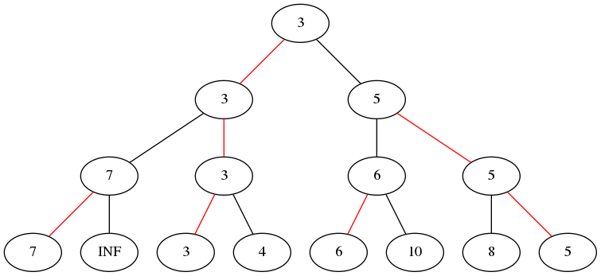

Last translate with upstream: [08eb0c5](https://github.com/OI-wiki/OI-wiki/commit/08eb0c53b1ad55b518b0f5f7a569c25b8c1215b2#diff-ba0721b5c036c9f0301e88f3247a0b128f22996796cd5526d5d6220ef53d01b3) [#3333](https://github.com/OI-wiki/OI-wiki/pull/3333) on Jul 17, 2021.

This article will briefly introduce the tournament sort.

## Introduction

Tournament sort<!---, or tree selection sort,--> is a optimization for naive [selection sort](./selection-sort.md), and a variation of [heapsort](./heap-sort.md) (with complete ). It performs based by selection sort by using a priority queue to find next element to select.

The algorithm is named after a single-elimination tournament, where there are many players (or teams) that play in two-sided matches. Each much compares the players and the winning one is promoted to next round. The tournament determines the best player, but the player who was beaten in the final match may not be the second best – he may be inferior to other players the winner bested.[^ref1] <!---原文于此处部分引用了Wikipedia对其构词学的描述, 故加上ref --> 

## Working Theory

Here is an illustration of **minimum tournament tree** for example:


The leaf nodes represent unordered elements. The red edges represent winner path of each round. Obviously, finishing a tournament can find out the minimum element from a group of elements.

After each round of comparison among $n$ elements, we will have $\frac{n}{2}$ "winners". The smaller one from each pair of elements will enter next round of comparison. If no pair could be made, this element will directly enter next round.



After one "tournament" we need to eliminate the winner element by setting it to $\infty$ (which is similar to [heapsort](./heap-sort.md))and hold the "tournament" again to select secondly small element.

The repeat these operations until all elements are ordered.

## Properties

### Stability

Tournament sort is an unstable sorting algorithm.

### Time Complexity

The best-case, average-case and worst-case time complexity of a tournament sort are all $O(n\log n)$. It uses a time complexity of $O(n)$ to initialize a "tournament", and $O(\log n)$ to select a minimum element from $n$ elements.

### Space Complexity

The space complexity of a tournament sort is $O(n)$.

## Code Implementations

### C++

```cpp
// C++ Version
int n, a[maxn], tmp[maxn << 1];

int winner(int pos1, int pos2) {
  int u = pos1 >= n ? pos1 : tmp[pos1];
  int v = pos2 >= n ? pos2 : tmp[pos2];
  if (tmp[u] <= tmp[v]) return u;
  return v;
}

void create_tree(int &value) {
  for (int i = 0; i < n; i++) tmp[n + i] = a[i];
  for (int i = 2 * n - 1; i > 1; i -= 2) {
    int k = i / 2;
    int j = i - 1;
    tmp[k] = winner(i, j);
  }
  value = tmp[tmp[1]];
  tmp[tmp[1]] = INF;
}

void recreate(int &value) {
  int i = tmp[1];
  while (i > 1) {
    int j, k = i / 2;
    if (i % 2 == 0 && i < 2 * n - 1)
      j = i + 1;
    else
      j = i - 1;
    tmp[k] = winner(i, j);
    i = k;
  }
  value = tmp[tmp[1]];
  tmp[tmp[1]] = INF;
}

void tournament_sort() {
  int value;
  create_tree(value);
  for (int i = 0; i < n; i++) {
    a[i] = value;
    recreate(value);
  }
}
```

### Python

```python
# Python Version
n = 0
a = [0] * maxn
tmp = [0] * maxn * 2

def winner(pos1, pos2):
    u = pos1 if pos1 >= n else tmp[pos1]
    v = pos2 if pos2 >= n else tmp[pos2]
    if tmp[u] <= tmp[v]:
        return u
    return v

def create_tree(value):
    for i in range(0, n):
        tmp[n + 1] = a[i]
    for i in range(2 * n -1, 1, -2):
        k = int(i / 2)
        j = i - 1
        tmp[k] = winner(i, j)
    value = tmp[tmp[i]]
    tmp[tmp[i]] = INF

def recreate(value):
    i = tmp[1]
    while i > 1:
        j = k = int(i / 2)
        if i % 2 == 0 and i < 2 * n - 1:
            j = i + 1
        else:
            j = i - 1
        tmp[k] = winner(i, j)
        i = k
    value = tmp[tmp[1]]
    tmp[tmp[1]] = INF

def tournament_sort():
    value = 0
    create_tree(value)
    for i in range(0, n):
        a[i] = value
        recreate(value)
```

## Further Reading / External Links

- [Tournament sort - Wikipedia](https://en.wikipedia.org/wiki/Tournament_sort)

## References and Footnotes

[^ref1]: [Tournament sort - Wikipedia](https://en.wikipedia.org/wiki/Tournament_sort#Etymology) (Chapter "Etymology")
