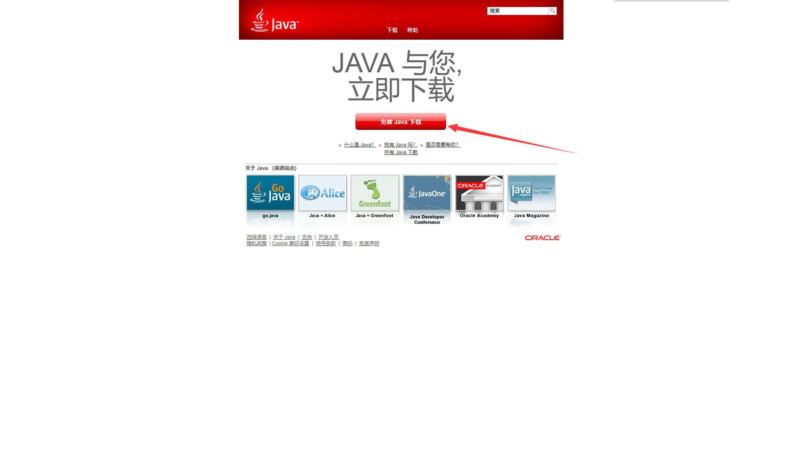
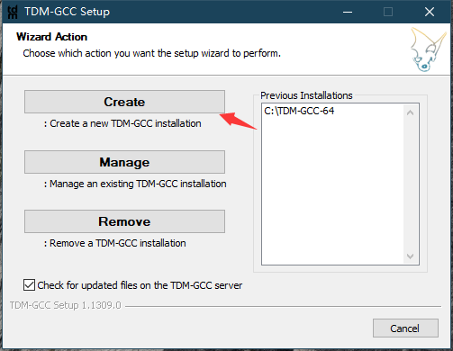
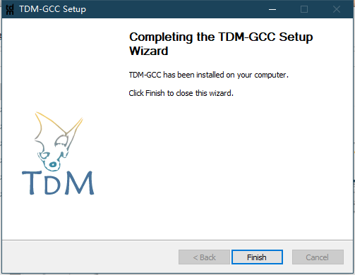
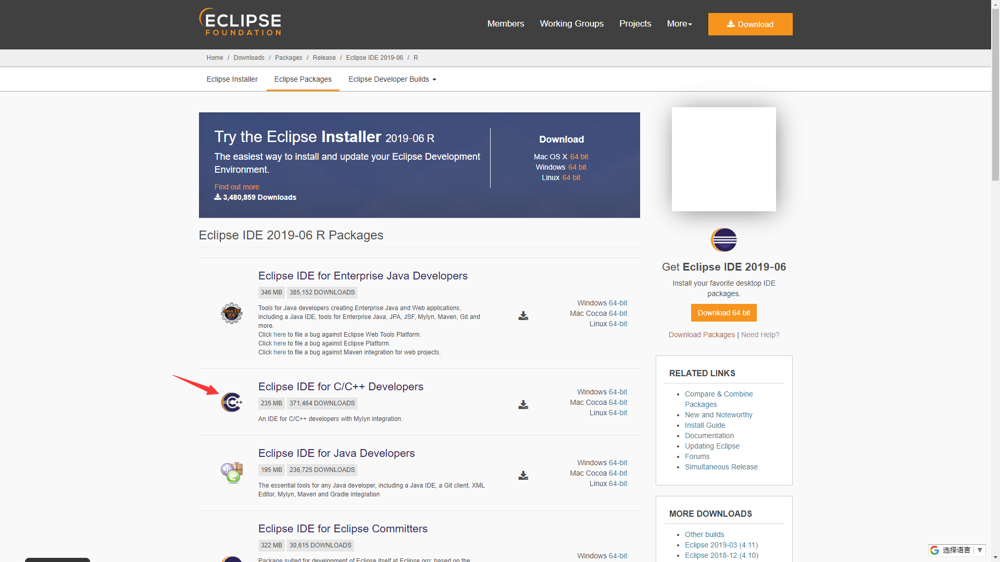
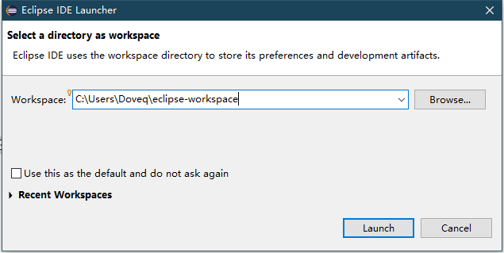
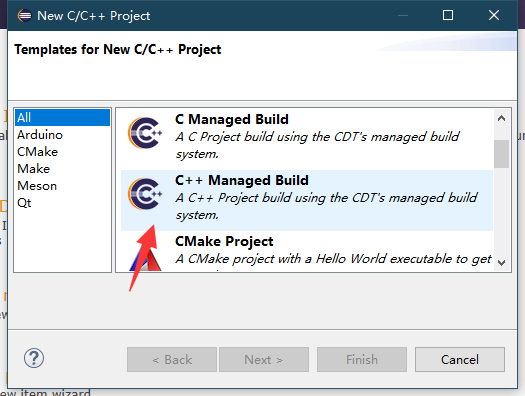
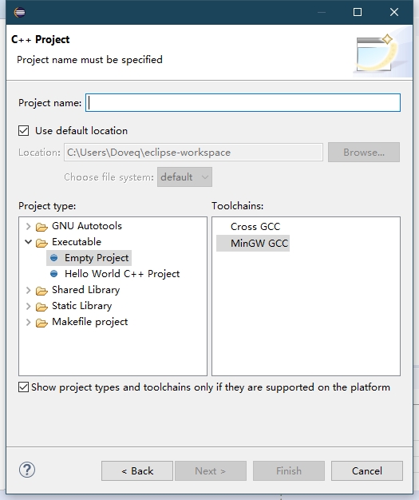

author: ouuan, Doveqise, partychicken, Xeonacid, StudyingFather, CamberLoid (as translator)

Last translated on August 31st, 2021, with commit [663c0d0](https://github.com/OI-wiki/OI-wiki/commit/663c0d00574ae5528ecd8490403e0527672cd2ae)

This article will briefly introduce Eclipse.

## Introduction

Eclipse is a famous cross-platform open-source integrated development environment. Eclipse is initially used to develop in Java, and currently it is also used to develop in other programming language like C++, Python and PHP through plug-in. 

Eclipse itself is a framework platform. However, supports from various plug-ins provides Eclipse good scalability. Therefore, many software developers choose Eclipse as the framework to develop their own IDE.

Eclipse is originally the next generation IDE developed by IBM as an alternative of commercial software Visual Age for Java. In November 2001, it was donated to open-source community, and is now being managed by Eclipse, a non-profit organization.

Advantages: 
- Better experience;
- Easy to get started.

Drawbacks: 
- Eclipse is slower in opening than Visual Studio;
- Unpredictable updating frequency, which means updating of plug-ins may not be not able to follow up Eclipse's. 

## Installation and Configuration Guide

For major linux distributions, Eclipse is already in their package repositories. This instruction is based on Microsoft Windows. 

### Perquisites

You will need Java Runtime and MinGW.

#### Download & Install Java Runtime

As for August 18th, 2021, the latest Eclipse has integrated a Java runtime environment. You can also download an independent JRE from if needed.

#### Download & Install MinGW/TDM-GCC

TDM-GCC is a compiler suite for Microsoft Windows, providing latest stable GCC compiler and patched MinGW/MinGW-w64 runtime API.

The installer of TDM-GCC can be obtained from GitHub Release or SourceForge. Here we uses 

Start installation.

Select the version of installation. 

Select installation directory. The default is `C:\TDM-GCC-64`

Select components to install. Here we proceed with default settings.

Finish Installation.

### Install Eclipse

Heading to the homepage of Eclipse 

Download the C++ version installer of your operating system.

Extract the compressed file downloaded and create a new project by entering directory information.

## Advanced Readings

The manual of Eclipse is detailed, therefore we recommend newly users to read the manual or Google when encountering problems. And Eclipse's feel of use is similar to Visual Studio.

Similar to [Visual Studio Code](./vscode.md), Eclipse provides many plug-ins, which may help Eclipse be even easy to use.

## References and Footnotes

[^ref1]: [Eclipse - 维基百科](https://zh.wikipedia.org/wiki/Eclipse)

[^ref2]: [曾经的 Java IDE 王者 Eclipse 真的没落了？21 款插件让它强大起来！](https://blog.csdn.net/csdnnews/article/details/78495979)
